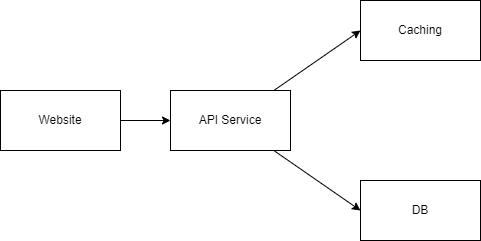
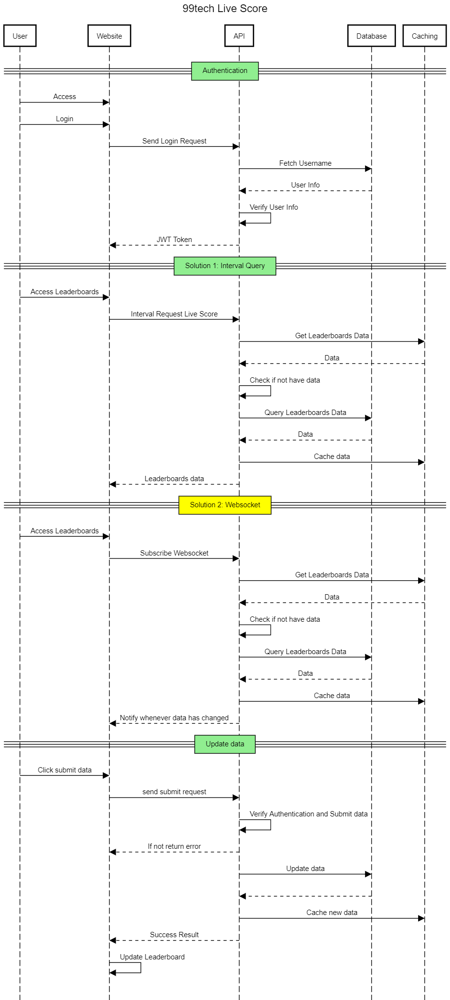

# 99Tech Live Score API Specifications

# **1. Software Requirements**
1. We have a website with a score board, which shows the top 10 user’s scores.
2. We want live update of the score board.
3. User can do an action (which we do not need to care what the action is), completing this action will increase the user’s score.
4. Upon completion the action will dispatch an API call to the application server to update the score.
5. We want to prevent malicious users from increasing scores without authorisation.

# **2. Solution**
To address these requirements, I will implement four modules:

1. API Service: This module will handle authentication, score data updates, and score data retrieval.
2. Caching (Redis): Utilized for storing leaderboard data in memory to enable faster access.
3. DB: This module will store data persistently for long-term usage.
4. Website: The website will be responsible for displaying the data to users.

Below, you can see the architecture diagram:

Additionally, here's the sequence diagram for a better understanding of the workflow:

Authentication will be carried out using JWT Tokens. We have 2 approaches to solve this problem: 
 - Utilize the API to periodically query for leaderboard data.
 - Implement Websockets to enable real-time notifications when leaderboard changes occur.

# **3. API Specs**

| API                   | Method | Type    | Payload             | Response             | Description          |
| --------------------- | ------ | ------- | ------------------- | -------------------- | -------------------- |
| /auth/signin          | GET    | public  | {username,password} | JWT Token            | Login API            |
| /scores/top?length=10 | GET    | public  |                     | [{name,score}]       | Get Leaderboard data |
| /scores               | POST   | private |                     | {success:true/false} | Submit score         |
